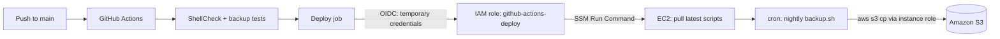
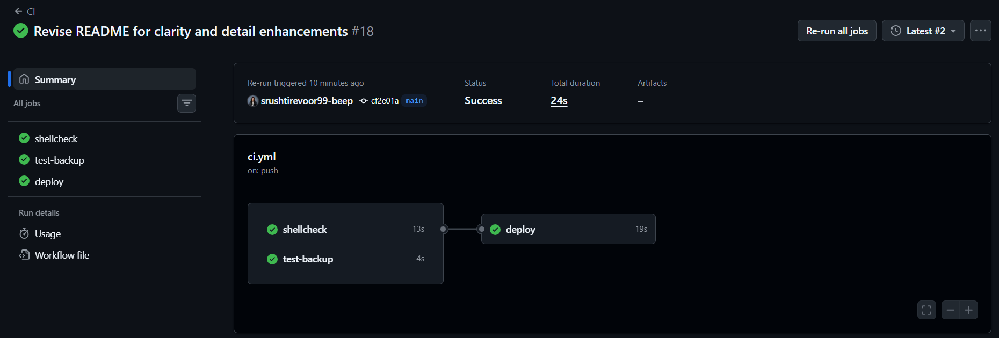

# CloudOps Toolkit

**Automated backups to Amazon S3 with a fully automated CI/CD pipeline, built with Bash, AWS, and GitHub Actions.**

[](https://github.com/srushtirevoor99-beep/cloudops-toolkit/actions/workflows/ci.yml)


---

## Overview

The CloudOps Toolkit is a collection of Bash scripts for Linux administration and cloud operations. Its main workflow is a reliable backup pipeline:

1. Archive a folder into a timestamped `.tar.gz` file.
2. Upload the archive to **Amazon S3**.
3. Run it nightly on an **EC2** instance with **cron**.
4. Deploy every change to that instance automatically through **GitHub Actions**, without storing AWS keys anywhere.

I built it to practise Linux, Bash, Git workflows, core AWS services, and CI/CD, and I documented each step with evidence.

## Features

- **Compressed, dated backups:** `backup-YYYY-MM-DD.tar.gz`
- **Optional S3 upload:** set the `BUCKET_NAME` environment variable; without it, the backup stays local
- **Safe failure handling:** a missing source folder or a failed `tar` stops the script with a non-zero exit code, so an empty archive is never uploaded
- **Local retention:** keeps only the 5 most recent local backups
- **Keyless AWS access:** the EC2 instance uses an IAM role, and GitHub Actions signs in with short-lived OIDC credentials
- **Automated checks:** ShellCheck linting and functional tests of the backup script on every push and pull request
- **Automated deployment:** a successful run on `main` updates the code on EC2 through AWS Systems Manager

## Architecture



**Summary:** a push to `main` is checked by GitHub Actions, then deployed to EC2 without any stored AWS keys. On the server, cron runs `backup.sh` every night and uploads the archive to S3.

## Tech Stack

| Technology | Purpose |
|---|---|
| Bash | Backup automation and utility scripts |
| Linux (Ubuntu on WSL2, Amazon Linux 2023 on EC2) | Development and server environment |
| Amazon EC2 | Server that runs the scheduled backups |
| Amazon S3 | Off-server backup storage |
| AWS IAM | Roles and least-privilege-style access for EC2 and GitHub |
| AWS Systems Manager | Remote deployment and browser-based access without SSH |
| GitHub Actions + OIDC | CI/CD with short-lived AWS credentials |
| ShellCheck | Static analysis of the shell scripts |
| cron | Nightly scheduling on the EC2 instance |
| Git and GitHub | Version control, branches, and pull requests |

## AWS Infrastructure

| Resource | Details |
|---|---|
| Region | Asia Pacific (Mumbai), `ap-south-1` |
| EC2 instance | `cloudops-backup-server`, `t3.micro`, Amazon Linux 2023 |
| Instance access | Systems Manager Session Manager and EC2 Instance Connect |
| S3 bucket | `srushti-cloudops-backups-4821`, backups under `backups/` |
| Instance role | `cloudops-ec2-s3-role`, gives the instance temporary S3 access |
| Deploy role | `github-actions-deploy`, assumed by GitHub Actions through OIDC |
| Deploy policy | `github-deploy-ssm`, allows running shell commands on this one instance only |

## CI/CD Pipeline



The workflow in [`.github/workflows/ci.yml`](.github/workflows/ci.yml) runs on every push and pull request to `main`:

| Job | What it does |
|---|---|
| `shellcheck` | Lints every script in `scripts/` |
| `test-backup` | Runs `backup.sh` and checks a normal run, a failure on a missing source, and that retention keeps 5 archives |
| `deploy` | Runs on `main` after both checks pass: signs in with OIDC, then uses SSM Run Command to pull the latest code onto EC2. The job fails if the remote command fails |

**How the keyless deployment works**

| Component | Setup |
|---|---|
| OIDC identity provider | `token.actions.githubusercontent.com` |
| IAM role trust | Only this repository's `main` branch can assume `github-actions-deploy` |
| IAM permissions | `ssm:SendCommand` on the `AWS-RunShellScript` document and this single instance, plus read access to command status |
| GitHub configuration | Repository variables `AWS_ROLE_ARN` and `EC2_INSTANCE_ID`; no access keys or secrets |

> **Note:** the EC2 instance must be running and *Online* in Systems Manager. If it is stopped, the deploy job fails with `InvalidInstanceId`.

## Getting Started

### Prerequisites

- Linux, macOS, or WSL2
- [AWS CLI v2](https://docs.aws.amazon.com/cli/latest/userguide/getting-started-install.html) (only needed for S3 uploads)
- An AWS account and an S3 bucket (only needed for S3 uploads)

### Run a local backup

```bash
git clone https://github.com/srushtirevoor99-beep/cloudops-toolkit.git
cd cloudops-toolkit
chmod +x scripts/*.sh

./scripts/backup.sh <source_dir> <dest_dir>
# example
./scripts/backup.sh ~/testdata ~/testbackups
```

### Back up and upload to S3

```bash
export BUCKET_NAME=your-bucket-name
./scripts/backup.sh ~/testdata ~/testbackups
aws s3 ls s3://$BUCKET_NAME/backups/
```

On EC2, credentials come from the instance's IAM role, so no `aws configure` step is needed. On a laptop, use an **IAM user's** access key (never the root account) and never commit keys to the repository.

### Schedule it with cron (on EC2)

```cron
0 2 * * * BUCKET_NAME=<your-bucket> /home/ec2-user/cloudops-toolkit/scripts/backup.sh <source_dir> /home/ec2-user/local-backup >> /home/ec2-user/backup.log 2>&1
```

The server clock is UTC, so this runs daily at 02:00 UTC (07:30 IST).

### Verify a backup

```bash
aws s3 cp s3://<your-bucket>/backups/backup-YYYY-MM-DD.tar.gz /tmp/backup-test.tar.gz
tar -tzf /tmp/backup-test.tar.gz
```

## Scripts

```text
cloudops-toolkit/
├── .github/
│   └── workflows/
│       └── ci.yml
├── scripts/
│   ├── backup.sh
│   ├── disk-alert.sh
│   ├── log-analyzer.sh
│   ├── log-cleaner.sh
│   ├── memory-alert.sh
│   └── sysinfo.sh
├── docs/
│   └── screenshots/
├── .gitignore
└── README.md
```

| Script | Purpose | Status |
|---|---|---|
| `backup.sh` | Compressed, timestamped backup with local retention and optional S3 upload | Linted, tested in CI, and running on EC2 |
| `disk-alert.sh` | Warns when disk usage crosses a threshold | Linted |
| `memory-alert.sh` | Warns when memory usage crosses a threshold | Linted |
| `log-analyzer.sh` | Log analysis helper | Linted |
| `log-cleaner.sh` | Log cleanup helper | Linted |
| `sysinfo.sh` | System information summary | Linted |

> The backup workflow is the part verified end to end. The other scripts pass ShellCheck but do not yet have functional tests.

## Testing and Verification

| # | Check | Result |
|---|---|---|
| 1 | Local backup created from a test folder (WSL2) | `.tar.gz` archive created |
| 2 | Upload to S3, verified with `aws s3 ls` | Archive listed in the bucket |
| 3 | Download on EC2 and inspect with `tar -tzf` | Archive readable and contains the test data |
| 4 | `aws sts get-caller-identity` on EC2 | Shows the assumed instance role, with no stored keys |
| 5 | Missing source folder | Script exits with an error and uploads nothing |
| 6 | Cron tested with a 3-minute schedule, then set to daily | Log shows `Backup saved` and `Uploaded`; S3 timestamp updated |
| 7 | CI `test-backup` job: normal run, failure case, retention of 5 | Passing in GitHub Actions |
| 8 | CD `deploy` job: push to `main` updates the code on EC2 | Passing in GitHub Actions |

## Security

- IAM roles instead of stored access keys on EC2
- GitHub Actions authenticates through OIDC with short-lived credentials, so no AWS keys live in the repository or in GitHub secrets
- The deploy role can only be assumed from this repository's `main` branch and can only run commands on one instance
- Daily AWS CLI use through an IAM user rather than the root account, with MFA enabled on the root account
- New S3 bucket with the default Block Public Access protections
- No credentials, private keys, or tokens in the repository

**Known limitations**

- The instance role currently uses `AmazonS3FullAccess`. Scoping it to the one bucket is on the roadmap.
- The nightly job backs up a demo directory, so it is not a production backup policy.

## Operations and Cost

- The instance is stopped when not in use to avoid charges. Scheduled backups and deployments only work while it is running.
- Before pushing to `main`, start the instance and wait until it shows *Online* in Systems Manager.
- Delete test backups from S3 when finished, and keep an AWS Budget alert enabled.

## Challenges and Lessons

- **A failing backup uploaded an empty archive.** Reading the cron log showed `tar` failing on a missing folder while the script still reported success and uploaded a tiny file. I fixed it by validating the source, checking `tar`'s exit status, and removing partial archives, then added a CI test so the failure case is covered.
- **A commit landed on `main` instead of a feature branch.** I moved it to the right branch and reset `main` to match `origin/main`, then merged it through a pull request.
- **The first deploy attempt failed with `InvalidInstanceId`.** Systems Manager could not target the instance, and the run passed once the instance was available. I documented the requirement and added a failure check so the workflow reports remote errors.
- **`Permission denied` on a new script.** The file was missing its executable bit, which `chmod +x` fixed.
- **Why roles beat keys.** Instance roles and OIDC give temporary credentials automatically, so there is nothing to leak or rotate.

## Roadmap

- [x] Backup script with compression, dated archives, and retention
- [x] S3 upload and restore verification
- [x] EC2 instance with an IAM role
- [x] CI with GitHub Actions and ShellCheck
- [x] Automated tests for `backup.sh`
- [x] Scheduled nightly backups with cron
- [x] Continuous deployment to EC2 with GitHub OIDC and SSM

## Author

**Srushti Revoor**, Information Science Engineering student and aspiring Cloud / CloudOps engineer.

[GitHub](https://github.com/srushtirevoor99-beep)

