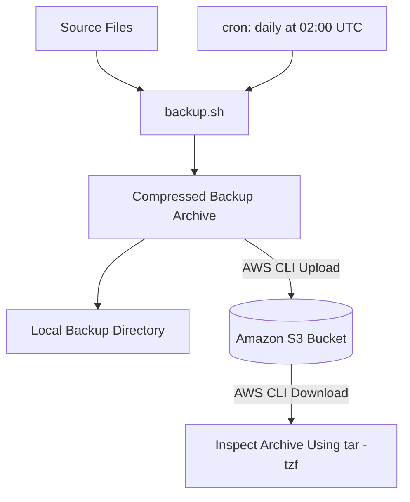
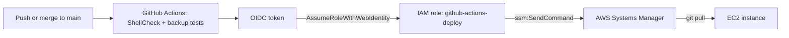

# ☁️ CloudOps Toolkit

[](https://github.com/srushtirevoor99-beep/cloudops-toolkit/actions/workflows/ci.yml)

A hands-on CloudOps project that combines **Bash scripting, Linux administration, GitHub Actions, and Amazon Web Services (AWS)** to automate system tasks, run a scheduled cloud backup workflow, and deploy script updates to EC2 through a secure CI/CD pipeline.

The project creates compressed backups, uploads them to Amazon S3, and verifies that they can be downloaded and inspected from an Amazon EC2 instance using an IAM role. A nightly cron job runs the backup on EC2. GitHub Actions validates the shell scripts, tests the backup script, and deploys merged changes to EC2 using GitHub OIDC and AWS Systems Manager, with no long-term AWS access keys and no open SSH port.

This project documents practical learning in Linux, automation, version control, CI/CD, cloud storage, and cloud infrastructure.

---

## Project Overview

CloudOps Toolkit is a collection of Bash scripts designed to simplify common Linux administration tasks.

The main cloud workflow follows these steps:

1. Select a directory containing files to back up.
2. Create a compressed, timestamped `.tar.gz` archive.
3. Store a local copy of the backup.
4. Upload the archive to an Amazon S3 bucket.
5. Run the backup automatically every night on EC2 using cron.
6. Download an uploaded archive from EC2 and inspect its contents to verify that it is readable.
7. Validate and test the scripts with GitHub Actions on every push and pull request.
8. Deploy merged changes to the EC2 instance automatically.

The project demonstrates how local Linux automation can be extended to use cloud infrastructure and a delivery pipeline.

## Features

- **Automated backups:** Creates compressed, timestamped backup archives.
- **Scheduled backups:** A cron job on EC2 runs the backup script daily at 02:00 UTC and writes output to a log file.
- **Amazon S3 integration:** Uploads backup archives to cloud storage.
- **Local backup retention:** Keeps the five most recent local backups, as implemented and tested in CI.
- **Error handling:** The backup fails with an error if the source directory is missing or `tar` fails, and preserves the local backup if an S3 upload fails.
- **EC2 integration:** Uses an Amazon EC2 instance to run scheduled backups and verify cloud backups.
- **IAM role-based access:** Uses temporary AWS credentials from an attached instance role instead of storing long-term access keys on EC2.
- **Automated code checks:** GitHub Actions runs ShellCheck and functional tests for the backup script.
- **Secure continuous deployment:** Merges to `main` deploy to EC2 through GitHub OIDC and AWS Systems Manager, with no access keys stored in GitHub and no inbound SSH.
- **Linux administration utilities:** Includes scripts for disk usage, memory usage, system information, and log analysis and cleanup.

> Note: The backup workflow, CI checks, and deployment pipeline have been verified. The other utility scripts still need more comprehensive functional testing.

---

## 🏗️ Architecture

### Backup workflow



### CI/CD pipeline



### How it works

1. **Bash** creates a compressed backup archive from the selected files.
2. **Local storage** keeps a copy of the archive, and retention keeps the five newest.
3. **Amazon S3** stores the backup in the cloud.
4. **cron on EC2** runs the backup script every night.
5. **IAM** gives the EC2 instance the permissions it needs to reach S3.
6. **GitHub Actions** runs ShellCheck and tests on every push and pull request.
7. **On merge to `main`**, GitHub requests a short-lived OIDC token, assumes an IAM role, and asks Systems Manager to run `git pull` on the instance, so the server always has the latest scripts.

---

## Technology Stack

| Technology | Purpose |
|---|---|
| Bash | Automation and Linux administration scripts |
| Linux / Ubuntu on WSL2 | Local development and testing |
| Amazon Linux 2023 | Operating system on the EC2 instance |
| Amazon EC2 | Cloud virtual machine for scheduled backups and verification |
| Amazon S3 | Cloud storage for backup archives |
| AWS IAM | Identity and access management, including the GitHub OIDC role |
| AWS Systems Manager | Remote command execution for deployment and browser-based access |
| AWS CLI v2 | Command-line interaction with AWS |
| cron | Scheduling nightly backups |
| Git | Version control |
| GitHub | Repository hosting and collaboration |
| GitHub Actions | Continuous integration and deployment |
| ShellCheck | Static analysis for shell scripts |

---

## AWS Configuration

The following AWS resources were configured and used during the project.

| Resource | Configuration |
|---|---|
| AWS Region | Asia Pacific (Mumbai): `ap-south-1` |
| EC2 Instance Name | `cloudops-backup-server` |
| EC2 Instance Type | `t3.micro` |
| Operating System | Amazon Linux 2023 |
| S3 Bucket | `srushti-cloudops-backups-4821` |
| S3 Backup Prefix | `backups/` |
| EC2 IAM Role | `cloudops-ec2-s3-role` |
| Deployment IAM Role | `github-actions-deploy` (assumed by GitHub Actions through OIDC) |
| Deployment IAM Policy | `github-deploy-ssm` (allows `ssm:SendCommand` on one instance and one document) |
| Identity Provider | `token.actions.githubusercontent.com` (OpenID Connect) |
| Instance Access | Systems Manager Session Manager and EC2 Instance Connect |

### Role of each AWS service

**Amazon EC2**

Provides a cloud-based Linux virtual machine that runs the scheduled backup and where uploaded archives can be downloaded and inspected.

**Amazon S3**

Provides durable object storage for backup archives, keeping a copy separate from the local backup directory.

**AWS IAM**

The EC2 instance role grants access to S3 without long-term access keys. A separate deployment role lets GitHub Actions obtain short-lived credentials through OIDC. Its trust policy is restricted to this repository and the `main` branch.

**AWS Systems Manager**

Runs the deployment command on the instance and provides browser-based terminal access, so no inbound SSH port is required.

> **Security consideration:** The EC2 role currently uses `AmazonS3FullAccess`. This is broader than required for a dedicated backup workflow. Replacing it with a bucket-scoped, least-privilege policy is a planned improvement. The deployment role, by contrast, is already scoped to a single instance and a single Systems Manager document.

---

## Getting Started

### Prerequisites

- Linux, macOS, or Windows with WSL2
- Bash and standard Linux utilities, including `tar`
- Git
- AWS CLI v2 for cloud operations
- An AWS account and an S3 bucket for upload testing
- Appropriate AWS permissions for the operations being performed

### 1. Clone the repository

```bash
git clone https://github.com/srushtirevoor99-beep/cloudops-toolkit.git
cd cloudops-toolkit
```

Make the scripts executable:

```bash
chmod +x scripts/*.sh
```

### 2. Run a local backup

The backup script accepts a source directory and a destination directory.

```bash
./scripts/backup.sh <source_dir> <dest_dir>
```

Example:

```bash
mkdir -p ~/testdata ~/testbackups
echo "CloudOps backup test" > ~/testdata/file.txt

./scripts/backup.sh ~/testdata ~/testbackups
```

List the generated backups:

```bash
ls -lh ~/testbackups
```

### 3. Upload a backup to Amazon S3

Set the name of your own S3 bucket:

```bash
export BUCKET_NAME=your-bucket-name
```

Run the backup script:

```bash
./scripts/backup.sh ~/testdata ~/testbackups
```

Verify that the archive exists in S3:

```bash
aws s3 ls "s3://$BUCKET_NAME/backups/"
```

Replace `your-bucket-name` with the actual name of your bucket.

### 4. Schedule the backup with cron

On the EC2 instance, `crontab -e` holds an entry like this (runs daily at 02:00 UTC):

```cron
0 2 * * * BUCKET_NAME=your-bucket-name /home/ec2-user/cloudops-toolkit/scripts/backup.sh /path/to/source /path/to/local-backups >> /home/ec2-user/backup.log 2>&1
```

Check the schedule and the latest run:

```bash
crontab -l
cat ~/backup.log
```

The cron job only runs while the instance is running.

### 5. Verify access from EC2

The EC2 instance should obtain AWS credentials through its attached IAM role.

Check the identity being used:

```bash
aws sts get-caller-identity
```

List the backups stored in S3:

```bash
aws s3 ls s3://srushti-cloudops-backups-4821/backups/
```

The identity command should show an assumed-role identity when the instance role is being used.

> For local development in WSL2, use an appropriately permissioned IAM identity. Never use root-account access keys or commit credentials to GitHub.

---

## Testing and Verification

The following checks were performed during project development.

| Test | Verification | Result |
|---|---|---|
| Local backup creation | Created a compressed archive from a test directory | Archive created |
| S3 upload | Listed the configured S3 backup prefix | Uploaded archive appeared |
| EC2 download | Downloaded the archive using AWS CLI | Archive downloaded |
| Archive inspection | Ran `tar -tzf` on the downloaded archive | Archive was readable and contained the expected test file |
| IAM role access | Ran `aws sts get-caller-identity` on EC2 | Confirmed role-based AWS identity |
| Scheduled backup | Checked `crontab -l`, `~/backup.log`, and the S3 listing | Cron job registered and backups reached S3 |
| CI validation | Checked GitHub Actions workflow runs | ShellCheck and backup tests passed |
| Automated deployment | Merged a change to `main` and checked the Actions run | `deploy` job succeeded and the instance pulled the new commit |

### Example: Download and inspect a backup

```bash
aws s3 cp \
  s3://srushti-cloudops-backups-4821/backups/backup-2026-10-08.tar.gz \
  /tmp/backup-test.tar.gz

tar -tzf /tmp/backup-test.tar.gz

rm -f /tmp/backup-test.tar.gz
```

The `tar -tzf` command lists the archive contents without extracting them.

**Important:** This verifies that the archive can be read and its contents listed. A complete restoration test would extract the files into a temporary directory and compare them with the originals. Automated restoration testing remains a future improvement.

---

## Continuous Integration and Deployment

The repository has a single workflow, `.github/workflows/ci.yml`, with three jobs.

| Job | Trigger | Purpose |
|---|---|---|
| `shellcheck` | Push and pull request to `main` | Runs ShellCheck on every shell script |
| `test-backup` | Push and pull request to `main` | Runs functional tests on `backup.sh` (see below) |
| `deploy` | Push to `main` only, after the two jobs above pass | Deploys the latest code to EC2 |

**What `test-backup` checks:**

1. A normal run creates a valid archive containing the expected file.
2. A missing source folder makes the script fail.
3. Retention keeps only the five newest archives.

**How `deploy` works:**

1. The job requests a short-lived OpenID Connect (OIDC) token from GitHub.
2. AWS exchanges the token for temporary credentials by letting the job assume the `github-actions-deploy` role.
3. The job sends `git pull` to the instance through Systems Manager (`AWS-RunShellScript`) and waits for the result.
4. The job fails if the command does not finish successfully.

The deployment settings (`AWS_ROLE_ARN` and `EC2_INSTANCE_ID`) are stored as GitHub repository variables, not secrets, because they are identifiers rather than credentials. The instance must be running and online in Systems Manager for a deployment to succeed.

**Trust policy note:** The role's trust policy restricts access to this repository and the `main` branch. For this account, GitHub sends the OIDC subject with numeric owner and repository IDs, in the form `repo:<owner>@<owner-id>/<repo>@<repo-id>:ref:refs/heads/main`. A policy written in the plain `repo:<owner>/<repo>:...` form is rejected with a generic "Not authorized to perform sts:AssumeRoleWithWebIdentity" error. The actual subject was found by printing the token claims in a temporary debug step.

A successful workflow indicates that its configured checks passed. It does not guarantee that every script has been functionally tested.

---

## Repository Structure

```text
cloudops-toolkit/
├── .github/
│   └── workflows/
│       └── ci.yml
├── scripts/
│   ├── backup.sh
│   ├── disk-alert.sh
│   ├── log-analyzer.sh
│   ├── log-cleaner.sh
│   ├── memory-alert.sh
│   └── sysinfo.sh
├── .gitignore
└── README.md
```

### Script descriptions

| Script | Purpose |
|---|---|
| `backup.sh` | Creates compressed backups, applies local retention, and optionally uploads archives to S3 |
| `disk-alert.sh` | Checks disk usage and reports when usage crosses a configured threshold |
| `memory-alert.sh` | Checks memory usage and reports when usage crosses a configured threshold |
| `log-cleaner.sh` | Removes or archives old log files according to its configured rules |
| `log-analyzer.sh` | Analyses log files and reports selected patterns or statistics |
| `sysinfo.sh` | Displays system information |

The backup script is the primary workflow verified with AWS and CI. The other scripts are included as Linux administration utilities and require further testing before being treated as production-ready tools.

---

## Security Practices

- Use an IAM role for EC2 access instead of storing long-term AWS access keys on the instance.
- Deploy from GitHub Actions with OIDC and short-lived credentials, with no AWS access keys stored in GitHub.
- Restrict the deployment role's trust policy to one repository and one branch, and scope its permissions to one instance and one Systems Manager document.
- Run deployments through Systems Manager so no inbound SSH port has to be open.
- Follow the principle of least privilege when assigning IAM permissions.
- Keep AWS credentials, private keys, and GitHub tokens out of source code and screenshots.
- Use a restricted IAM identity for local AWS CLI operations.
- Keep S3 Block Public Access enabled unless public access is specifically required and reviewed.
- Restrict inbound network access to the ports and sources required.
- Check repository history if credentials are ever committed; deleting them from the latest version alone does not remove them from Git history.

---

## Challenges and Lessons Learned

- **Linux permissions:** Learned how executable permissions affect running Bash scripts and how `chmod +x` resolves permission issues.
- **AWS CLI configuration:** Learned the difference between configuring credentials on a local machine and obtaining temporary credentials through an EC2 IAM role.
- **Cloud storage:** Implemented an upload and download workflow using Amazon S3.
- **EC2 administration:** Used a cloud Linux instance to run scheduled backups and verify an archive.
- **Scheduling:** Set up a cron job with logging and learned that it only runs while the instance is running.
- **Git and GitHub:** Practised commits, branch management, pull requests, and workflow checks.
- **CI and ShellCheck:** Used automated checks and functional tests to catch problems before relying on the scripts.
- **OIDC and IAM debugging:** Troubleshot a generic "Not authorized to perform sts:AssumeRoleWithWebIdentity" error by checking the role ARN, audience, and identity provider, then printing the OIDC token claims to find the exact subject format GitHub sends.
- **IAM security:** Learned why role-based access, short-lived credentials, and least-privilege permissions are important for cloud workloads.

---

## Roadmap

- [x] Create timestamped compressed backups
- [x] Upload backup archives to Amazon S3
- [x] Configure an EC2 instance with an IAM role
- [x] Download and inspect an archive from S3 on EC2
- [x] Configure GitHub Actions and ShellCheck checks
- [x] Add automated tests for backup creation, missing sources, and retention
- [x] Schedule backups using cron
- [x] Deploy script updates to EC2 through a CI/CD workflow (GitHub OIDC and Systems Manager)
- [ ] Add automated tests for S3 upload failures
- [ ] Replace `AmazonS3FullAccess` with a least-privilege IAM policy
- [ ] Configure S3 lifecycle policies for old backups
- [ ] Add failure notifications, for example using Amazon SNS
- [ ] Add automated backup restoration tests
- [ ] Manage AWS infrastructure using Terraform

---

## Cost Management and Cleanup

- Stop the EC2 instance when it is not in use. Stopping an instance does not eliminate every possible charge; attached storage and other resources may still incur costs. While it is stopped, scheduled backups do not run and deployments will fail until it is started and shows as online in Systems Manager.
- Delete test backup objects from S3 when they are no longer needed.
- Review AWS billing and configure an AWS Budget alert.
- Check for unused resources before finishing a learning session.

---

## Author

**Srushti Revoor**

Information Science Engineering student | Aspiring Cloud / CloudOps Engineer

[GitHub Profile](https://github.com/srushtirevoor99-beep)
