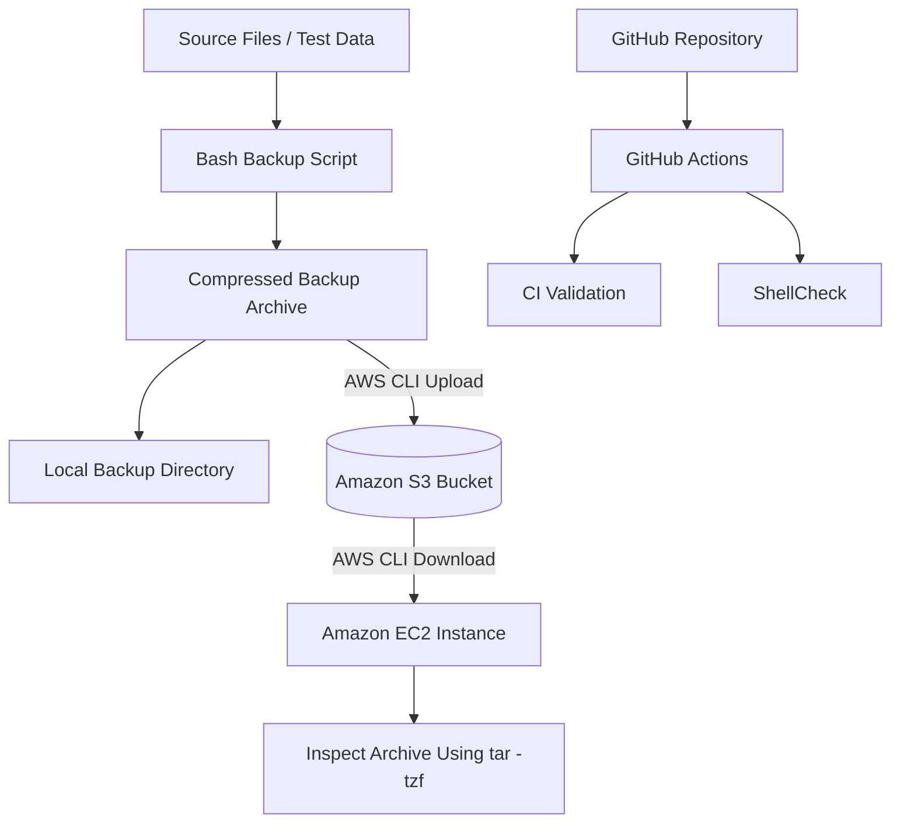

# ☁️ CloudOps Toolkit

[](https://github.com/srushtirevoor99-beep/cloudops-toolkit/actions/workflows/ci.yml)
[](https://github.com/srushtirevoor99-beep/cloudops-toolkit/actions/workflows/lint.yml)

A hands-on CloudOps project that combines **Bash scripting, Linux administration, GitHub Actions, and Amazon Web Services (AWS)** to automate system tasks and implement a cloud-based backup workflow.

The project creates compressed backups, uploads them to Amazon S3, and verifies that they can be downloaded and inspected from an Amazon EC2 instance using an IAM role. GitHub Actions and ShellCheck are used to validate the repository's shell scripts.

This project documents practical learning in Linux, automation, version control, CI, cloud storage, and cloud infrastructure.

---

## Project Overview

CloudOps Toolkit is a collection of Bash scripts designed to simplify common Linux administration tasks.

The main cloud workflow follows these steps:

1. Select a directory containing files to back up.
2. Create a compressed, timestamped `.tar.gz` archive.
3. Store a local copy of the backup.
4. Upload the archive to an Amazon S3 bucket.
5. Download the uploaded archive from an EC2 instance.
6. Inspect the archive contents to verify that it is readable.
7. Run automated repository checks using GitHub Actions.

The project demonstrates how local Linux automation can be extended to use cloud infrastructure.

## Features

- **Automated backups:** Creates compressed, timestamped backup archives.
- **Amazon S3 integration:** Uploads backup archives to cloud storage.
- **Local backup retention:** Keeps the five most recent local backups, as implemented in the script.
- **Upload failure handling:** Preserves the local backup if an S3 upload fails and reports an error.
- **EC2 integration:** Uses an Amazon EC2 instance to download and verify cloud backups.
- **IAM role-based access:** Uses temporary AWS credentials provided through an attached instance role instead of storing long-term AWS access keys on EC2.
- **Automated code checks:** Uses GitHub Actions to run repository validation and ShellCheck workflows.
- **Linux administration utilities:** Includes scripts for disk usage, memory usage, system information, and log analysis and cleanup.

> Note: The backup workflow and CI checks have been verified. The other utility scripts and backup-retention edge cases still need more comprehensive functional testing.

---

## 🏗️ Architecture



### How it works

1. **Bash** creates a compressed backup archive from your selected files.
2. **Local storage** keeps a copy of the archive.
3. **Amazon S3** stores the backup in the cloud.
4. **Amazon EC2** downloads the archive and checks its contents.
5. **IAM** provides the permissions needed for EC2 to access S3.
6. **GitHub Actions** runs CI validation and ShellCheck to check the code.
---

## Technology Stack

| Technology | Purpose |
|---|---|
| Bash | Automation and Linux administration scripts |
| Linux / Ubuntu on WSL2 | Local development and testing |
| Amazon Linux 2023 | Operating system on the EC2 instance |
| Amazon EC2 | Cloud virtual machine for backup verification |
| Amazon S3 | Cloud storage for backup archives |
| AWS IAM | Identity and access management |
| AWS Systems Manager | Browser-based instance access |
| AWS CLI v2 | Command-line interaction with AWS |
| Git | Version control |
| GitHub | Repository hosting and collaboration |
| GitHub Actions | Continuous integration workflows |
| ShellCheck | Static analysis for shell scripts |

---

## AWS Configuration

The following AWS resources were configured and used during the project.

| Resource | Configuration |
|---|---|
| AWS Region | Asia Pacific (Mumbai) — `ap-south-1` |
| EC2 Instance Name | `cloudops-backup-server` |
| EC2 Instance Type | `t3.micro` |
| Operating System | Amazon Linux 2023 |
| S3 Bucket | `srushti-cloudops-backups-4821` |
| S3 Backup Prefix | `backups/` |
| IAM Role | `cloudops-ec2-s3-role` |
| Instance Access | Systems Manager Session Manager and EC2 Instance Connect |

### Role of each AWS service

**Amazon EC2**

Provides a cloud-based Linux virtual machine on which AWS CLI commands can be executed and the backup archive can be downloaded and inspected.

**Amazon S3**

Provides durable object storage for backup archives, keeping a copy separate from the local backup directory.

**AWS IAM Role**

Grants the EC2 instance permission to access AWS services without requiring long-term access keys to be stored on the instance.

**AWS Systems Manager**

Provides browser-based terminal access to the EC2 instance, making administration possible without relying solely on a direct SSH connection.

> **Security consideration:** The configured EC2 role currently uses `AmazonS3FullAccess`. This is broader than required for a dedicated backup workflow. Replacing it with a bucket-scoped, least-privilege policy is a planned improvement.

---

## Getting Started

### Prerequisites

- Linux, macOS, or Windows with WSL2
- Bash and standard Linux utilities, including `tar`
- Git
- AWS CLI v2 for cloud operations
- An AWS account and an S3 bucket for upload testing
- Appropriate AWS permissions for the operations being performed

### 1. Clone the repository

```bash
git clone https://github.com/srushtirevoor99-beep/cloudops-toolkit.git
cd cloudops-toolkit
```

Make the scripts executable:

```bash
chmod +x scripts/*.sh
```

### 2. Run a local backup

The backup script accepts a source directory and a destination directory.

```bash
./scripts/backup.sh <source_dir> <dest_dir>
```

Example:

```bash
mkdir -p ~/testdata ~/testbackups
echo "CloudOps backup test" > ~/testdata/file.txt

./scripts/backup.sh ~/testdata ~/testbackups
```

List the generated backups:

```bash
ls -lh ~/testbackups
```

### 3. Upload a backup to Amazon S3

Set the name of your own S3 bucket:

```bash
export BUCKET_NAME=your-bucket-name
```

Run the backup script:

```bash
./scripts/backup.sh ~/testdata ~/testbackups
```

Verify that the archive exists in S3:

```bash
aws s3 ls "s3://$BUCKET_NAME/backups/"
```

Replace `your-bucket-name` with the actual name of your bucket.

### 4. Verify access from EC2

The EC2 instance should obtain AWS credentials through its attached IAM role.

Check the identity being used:

```bash
aws sts get-caller-identity
```

List the backups stored in S3:

```bash
aws s3 ls s3://srushti-cloudops-backups-4821/backups/
```

The identity command should show an assumed-role identity when the instance role is being used.

> For local development in WSL2, use an appropriately permissioned IAM identity. Never use root-account access keys or commit credentials to GitHub.

---

## Testing and Verification

The following checks were performed during project development.

| Test | Verification | Result |
|---|---|---|
| Local backup creation | Created a compressed archive from a test directory | Archive created |
| S3 upload | Listed the configured S3 backup prefix | Uploaded archive appeared |
| EC2 download | Downloaded the archive using AWS CLI | Archive downloaded |
| Archive inspection | Ran `tar -tzf` on the downloaded archive | Archive was readable and contained the expected test file |
| IAM role access | Ran `aws sts get-caller-identity` on EC2 | Confirmed role-based AWS identity |
| CI validation | Checked GitHub Actions workflow runs | CI and ShellCheck runs passed |

### Example: Download and inspect a backup

```bash
aws s3 cp \
  s3://srushti-cloudops-backups-4821/backups/backup-2026-10-08.tar.gz \
  /tmp/backup-test.tar.gz

tar -tzf /tmp/backup-test.tar.gz

rm -f /tmp/backup-test.tar.gz
```

The `tar -tzf` command lists the archive contents without extracting them.

**Important:** This verifies that the archive can be read and its contents listed. A complete restoration test would extract the files into a temporary directory and compare them with the originals. Automated restoration testing remains a future improvement.

---

## Continuous Integration

The repository contains GitHub Actions workflows in `.github/workflows/`.

| Workflow | Purpose |
|---|---|
| `ci.yml` | Runs the repository validation configured in the workflow |
| `lint.yml` | Runs ShellCheck on shell scripts |

The workflows are configured for pushes to `main` and pull requests targeting `main`.

A successful workflow indicates that its configured checks passed. It does not guarantee that every script has been functionally tested.

---

## Repository Structure

```text
cloudops-toolkit/
├── .github/
│   └── workflows/
│       ├── ci.yml
│       └── lint.yml
├── scripts/
│   ├── backup.sh
│   ├── disk-alert.sh
│   ├── log-analyzer.sh
│   ├── log-cleaner.sh
│   ├── memory-alert.sh
│   └── sysinfo.sh
├── .gitignore
└── README.md
```

### Script descriptions

| Script | Purpose |
|---|---|
| `backup.sh` | Creates compressed backups, applies local retention, and optionally uploads archives to S3 |
| `disk-alert.sh` | Checks disk usage and reports when usage crosses a configured threshold |
| `memory-alert.sh` | Checks memory usage and reports when usage crosses a configured threshold |
| `log-cleaner.sh` | Removes or archives old log files according to its configured rules |
| `log-analyzer.sh` | Analyses log files and reports selected patterns or statistics |
| `sysinfo.sh` | Displays system information |

The backup script is the primary workflow verified with AWS. The other scripts are included as Linux administration utilities and require further testing before being treated as production-ready tools.

---

## Security Practices

- Use an IAM role for EC2 access instead of storing long-term AWS access keys on the instance.
- Follow the principle of least privilege when assigning IAM permissions.
- Keep AWS credentials, private keys, and GitHub tokens out of source code and screenshots.
- Use a restricted IAM identity for local AWS CLI operations.
- Keep S3 Block Public Access enabled unless public access is specifically required and reviewed.
- Restrict inbound network access to the ports and sources required.
- Check repository history if credentials are ever committed; deleting them from the latest version alone does not remove them from Git history.

---

## Challenges and Lessons Learned

- **Linux permissions:** Learned how executable permissions affect running Bash scripts and how `chmod +x` resolves permission issues.
- **AWS CLI configuration:** Learned the difference between configuring credentials on a local machine and obtaining temporary credentials through an EC2 IAM role.
- **Cloud storage:** Implemented an upload and download workflow using Amazon S3.
- **EC2 administration:** Used a cloud Linux instance to verify a backup archive.
- **Git and GitHub:** Practised commits, branch management, repository updates, and workflow checks.
- **CI and ShellCheck:** Used automated checks to catch shell-script issues before relying on the scripts.
- **IAM security:** Learned why role-based access and least-privilege permissions are important for cloud workloads.

---

## Roadmap

- [x] Create timestamped compressed backups
- [x] Upload backup archives to Amazon S3
- [x] Configure an EC2 instance with an IAM role
- [x] Download and inspect an archive from S3 on EC2
- [x] Configure GitHub Actions and ShellCheck checks
- [ ] Add automated tests for backup retention and upload failures
- [ ] Schedule backups using cron or a systemd timer
- [ ] Replace `AmazonS3FullAccess` with a least-privilege IAM policy
- [ ] Configure S3 lifecycle policies for old backups
- [ ] Add failure notifications, for example using Amazon SNS
- [ ] Add automated backup restoration tests
- [ ] Deploy script updates to EC2 through a controlled CI/CD workflow
- [ ] Manage AWS infrastructure using Terraform

---

## Cost Management and Cleanup

- Stop the EC2 instance when it is not in use. Stopping an instance does not eliminate every possible charge; attached storage and other resources may still incur costs.
- Delete test backup objects from S3 when they are no longer needed.
- Review AWS billing and configure an AWS Budget alert.
- Check for unused resources before finishing a learning session.

---

##  Author

**Srushti Revoor**

Information Science Engineering student | Aspiring Cloud / CloudOps Engineer

[GitHub Profile](https://github.com/srushtirevoor99-beep)
